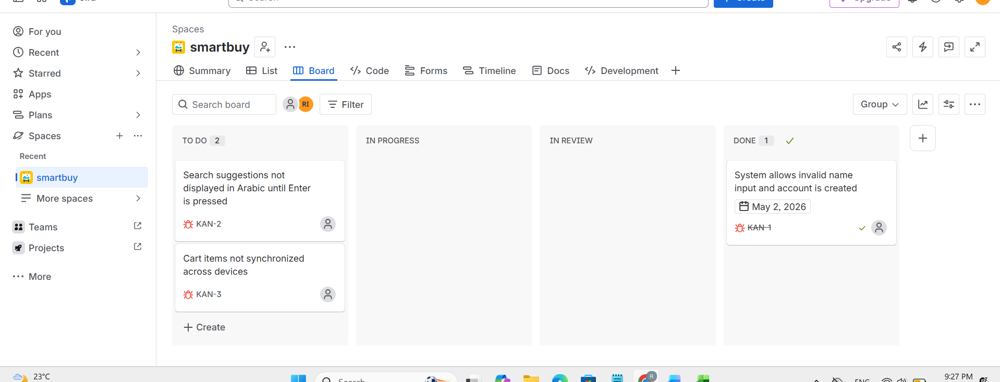

# Test Execution Summary Report: Smart Buy E-Commerce Post-Migration Analysis

* **Project Name:** Smart Buy E-Commerce Website
* **Lead Tester:** Randa Ismael
* **Primary Testing Phase:** Manual Execution (Apr 27-30, 2026)
* **Regression & Re-testing Phase:** Shopify Migration (Jun 23-24, 2026)

---

## 📝 Executive Summary: Quality Assessment
The Smart Buy E-Commerce platform has transitioned to a Shopify-based architecture, which was thoroughly evaluated during regression testing on Jun 23-24, 2026. This migration has successfully addressed high-priority security vulnerabilities identified during the initial manual testing phase (Apr 27-30). Most notably, we implemented a passwordless OTP login system, which resolved previous concerns about brute force protection and input validation.

Despite these improvements, two significant functional gaps remain unresolved: Arabic localisation in search and cross-device cart synchronisation. While the core transactional engine is stable and secure, these issues directly impact the user experience for the target demographic.

---

## 📊 Test Execution Dashboard

| Metric | Count | Percentage |
| :--- | :--- | :--- |
| **Total Test Cases** | 52 | 100% |
| **Passed** | 49 | 94.2% |
| **Failed** | 3 | 5.8% |

---

## 🔍 Detailed Module Analysis & Migration Impacts

| Module | Status | Execution & Regression Insights |
| :--- | :--- | :--- |
| **Sign Up** | 🟢 Pass (7/7) | The independent sign-up form was removed post-migration. Flow is now merged into Login via OTP. Bug Bi02 is resolved as name fields are no longer required. |
| **Login** | 🟢 Pass (11/11) | Resolved: Brute force protection (Bug Bi01) is now enforced by Shopify’s native rate limiting. Verified successful 6-digit OTP delivery and auto-submission. |
| **Search** | 🔴 Fail (4/5) | **Critical Gap:** Arabic search (TC22) still fails to display autosuggestions until "Enter" is pressed. This issue (Bug Bi03) remains persistent in the new flow. |
| **Add to Cart** | 🔴 Fail (5/6) | **Critical Gap:** Cart items (TC25) do not sync across devices. Items added on the desktop do not appear on mobile, remaining isolated to local sessions (Bug Bi04). |
| **Checkout** | 🟢 Pass (9/9) | Logic Update: Free shipping threshold updated from 100 JOD to 50 JOD. Verified successfully at boundaries 49, 50, and 51 JOD (TC39). |
| **Payment** | 🟢 Pass (6/6) | High reliability confirmed; system handles network interruptions (TC45) and sessions correctly expire after 10-15 minutes of inactivity (TC49). |
| **Sign Out** | 🟢 Pass (3/3) | Verified Shopify’s centralised revocation; "Sign Out from all devices" (TC52) successfully terminates sessions across Web and Mobile App (SSO). |

---

## 🪲 Defect Status Tracking (Jira Integrated)

| Bug ID | Jira Ticket | Summary | Severity | Status / Jira Board |
| :--- | :--- | :--- | :--- | :--- |
| **Bi01** | *Internal* | Brute force protection is not enforced | 🛑 High | 🟢 Fixed (Shopify Native) |
| **Bi02** | **[KAN-1]** | Name fields accept invalid characters | ⚠️ Medium | ✅ **Done** (Resolved) |
| **Bi03** | **[KAN-2]** | Arabic search suggestions missing | ⚠️ Medium | 🟦 **To Do** (On Jira Board) |
| **Bi04** | **[KAN-3]** | Cart items not synchronized across devices | ⚠️ Medium | 🟦 **To Do** (On Jira Board) |

### 📋 Jira Kanban Board Preview
*Below is a preview of the active defect tracking and sprint management board on Jira:*

---

## 🚀 Strategic Recommendations
* 📌 **Priority 1 (Usability):** Investigate Shopify's "Persistent Cart" settings or API configurations to resolve the cross-device synchronisation issue (Bug Bi04).
* 📌 **Priority 2 (Localisation):** Optimise the search API to trigger autosuggestions for Arabic script based on character count rather than keyboard events (Bug Bi03).
* 📌 **Priority 3 (Monitoring):** Monitor the OTP delivery success rates to ensure consistent access for users during high-traffic periods.
